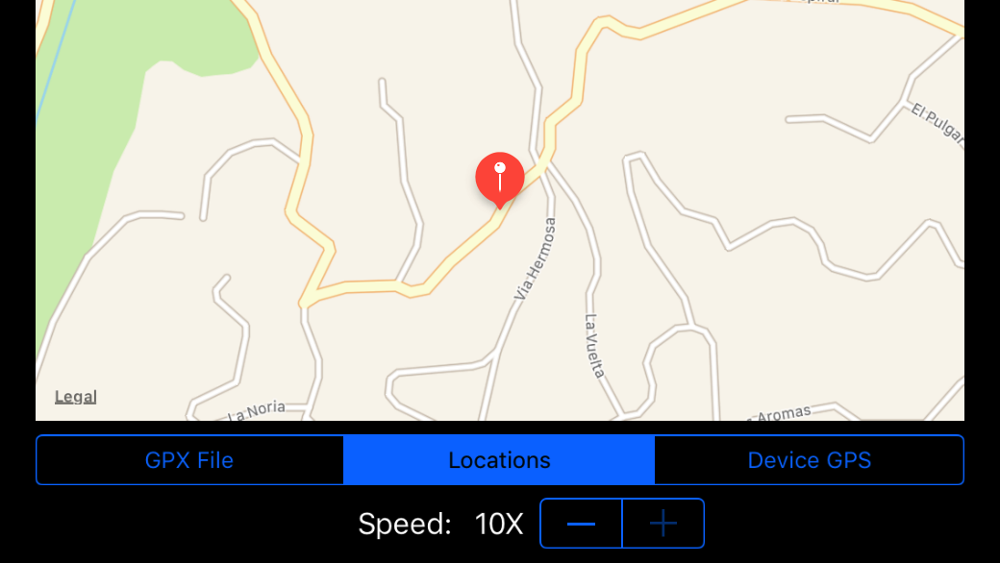

GpxLocationManager
===================
[](https://travis-ci.org/vermont42/GpxLocationManager)
[](https://twitter.com/vermont42/status/784504585243078656)



Xcode’s iOS-app simulator helpfully provides four sets of GPS data for development of apps using `CLLocationManager`: Apple campus, city bike ride, city run, and highway drive. Josh Adams developed [an](https://github.com/vermont42/RaceRunner) [app](https://itunes.apple.com/us/app/racerunner-run-tracking-app/id1065017082) that uses GPS and found this data deficient in two ways. First, the data contain no altitudes other than “0”. Altitude tracking is important for his app, and this inability to test his app’s altitude tracking was unacceptable. Second, the simulator provides data only at 1X speed. During his develop/run/debug/run cycle, he became impatient waiting for the simulator to provide GPS data to his app, even using the relatively fast-moving highway-drive mode.

In an epic bout of [yak shaving](http://sethgodin.typepad.com/seths_blog/2005/03/dont_shave_that.html), Adams remedied these deficiencies by developing `GpxLocationManager`. This class can replace `CLLocationManager` at compile- or runtime, allowing clients to access GPS data from two sources: [GPX](https://en.wikipedia.org/wiki/GPS_Exchange_Format) files and arrays of `CLLocation`s. In particular, `GpxLocationManager` invokes its clients’ `didUpdateLocation()` method with GPS data from either of these two sources. `GpxLocationManager` can provide this data at the same speed it was recorded or sped up by an arbitrary amount. Thanks to the hard work of [Nehal Kanetkar](https://github.com/nkanetka), `GpxLocationManager` supports [simulating](http://nkanetka.github.io/projects/gpx/) course and speed.

The maintainers welcome pull requests for  `GpxLocationManager`.

Adams demonstrated `GpxLocationManager` to the [Swift Language User Group](http://www.meetup.com/swift-language/) in [San Francisco](http://www.sanfrancisco.travel). [Realm](http://realm.io) was [kind](https://www.youtube.com/watch?v=LI7-Cu-9wWM) enough to record, transcribe, and host [his talk](https://realm.io/news/josh-adams-gpx-location-manager/).

## Installation
To get the project up and running, please install [SwiftLint](https://github.com/realm/SwiftLint) by running `brew install swiftlint`.

## Use
Here are the steps to use `GpxLocationManager` in your app.

1\. Obtain the framework via CocoaPods or by copying the files GpxLocationManager.swift, LocationManager.swift, and GpxParser.swift to your project. If you go the CocoaPods route, you will need to `import GpxLocationManager` in any file using classes from that framework.

2\. If you want `GpxLocationManager` to use data from the GPX file `gpxFile.gpx`, initialize as follows:

```swift
let locationManager = LocationManager(type: .gpxFile("gpxFile"))
```

If you want `GpxLocationManager` to use an array of `CLLocation`s called `locations`, initialize as follows:

```swift
let locationManager = LocationManager(type: .locations(locations))
```

If you want data to come from a real `CLLocationManager`, initialize as follows:

```swift
let locationManager = LocationManager(type: .coreLocation)
```

3\. Set the `LocationManager`’s delegate to something that implements `CLLocationManagerDelegate`.

4\. Optionally set the `LocationManager`’s `secondLength` property to something other than 1.0. A lower value speeds up the underlying `GpxLocationManager`. If the `LocationManager` wraps a `CLLocationManager`, this property has no effect.

5\. Invoke the `LocationManager`’s `startUpdatingLocation()` method. The `LocationManager` will start calling the delegate’s `didUpdateLocations()` method using data from the device’s GPS, the simulator’s GPS, the GPX file you specified, or the `CLLocation` array you specified.

6\. Invoke the `LocationManager`’s `stopUpdatingLocation()` method to pause the location updates.

7\. If you are running a `GpxLocationManager` and want to stop the `NSTimer` causing it to invoke `didUpdateLocations()`, invoke the `LocationManager`’s `kill()` method. This method has no effect if there is an underlying `CLLocationManager`.

Because `LocationManager` can wrap either a `GpxLocationManager` or `CLLocationManager`, swapping those two at runtime is easy. If you will never need the data from a `CLLocationManager`, just use `GpxLocationManager`.


## Demo

Run the `Demo` scheme. `DemoViewController.swift` shows the three ways to instantiate `LocationManager`.

[Click here](https://vimeo.com/138813570) to watch an older version of the demo in action. In this run, `GpxLocationManager` gets GPS data from a GPX file, and the demo plays the data back sped up ten times. Note that a 40-minute run takes four minutes to watch.

## Comments

If you use or are intrigued by `GpxLocationManager`, please consider starring the repo.

`GpxLocationManager` is not a functionally complete replacement for `CLLocationManager`. The former lacks much of the latter’s functionality. `GpxLocationManager`’s primary function is to invoke `didUpdateLocations()` with arbitrary location data. That said, `GpxLocationManager` could certainly serve as a starting point for a functionally complete replacement for `CLLocationManager`.

`GpxLocationManager` correctly parses GPX files created by iSmoothRun, Runmeter, and Runkeeper. Adams has not tested GPX files from other sources.

Some apps currently using `GpxLocationManager` include [RaceRunner](https://itunes.apple.com/us/app/racerunner-run-tracking-app/id1065017082) and [Touchdown](http://touchdownapp.ca).

## Credits

Josh Adams ([Twitter](https://twitter.com/vermont42) | [GitHub](https://github.com/vermont42) | [Website](http://racecondition.software)) created `GpxLocationManager`. He and Nehal Kanetkar ([Twitter](https://twitter.com/KanetkarNehal) | [GitHub](https://github.com/nkanetka) | [Website](http://nkanetka.github.io)) maintain it.

## License
```
The MIT License (MIT)

Copyright (c) 2015 Josh Adams

Permission is hereby granted, free of charge, to any person obtaining a copy
of this software and associated documentation files (the "Software"), to deal
in the Software without restriction, including without limitation the rights
to use, copy, modify, merge, publish, distribute, sublicense, and/or sell
copies of the Software, and to permit persons to whom the Software is
furnished to do so, subject to the following conditions:

The above copyright notice and this permission notice shall be included in all
copies or substantial portions of the Software.

THE SOFTWARE IS PROVIDED "AS IS", WITHOUT WARRANTY OF ANY KIND, EXPRESS OR
IMPLIED, INCLUDING BUT NOT LIMITED TO THE WARRANTIES OF MERCHANTABILITY,
FITNESS FOR A PARTICULAR PURPOSE AND NONINFRINGEMENT. IN NO EVENT SHALL THE
AUTHORS OR COPYRIGHT HOLDERS BE LIABLE FOR ANY CLAIM, DAMAGES OR OTHER
LIABILITY, WHETHER IN AN ACTION OF CONTRACT, TORT OR OTHERWISE, ARISING FROM,
OUT OF OR IN CONNECTION WITH THE SOFTWARE OR THE USE OR OTHER DEALINGS IN THE
SOFTWARE.
```


## The End
